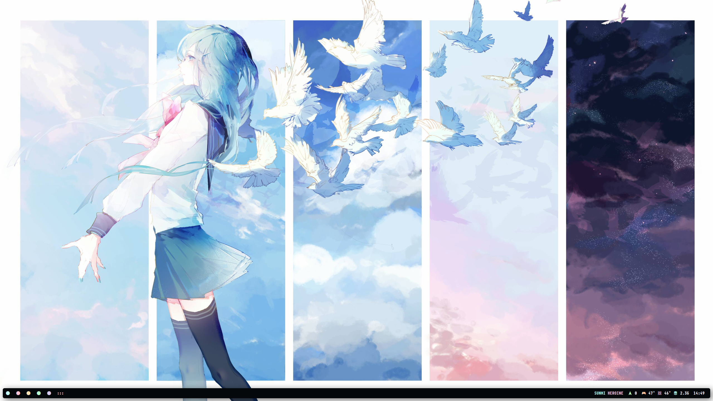
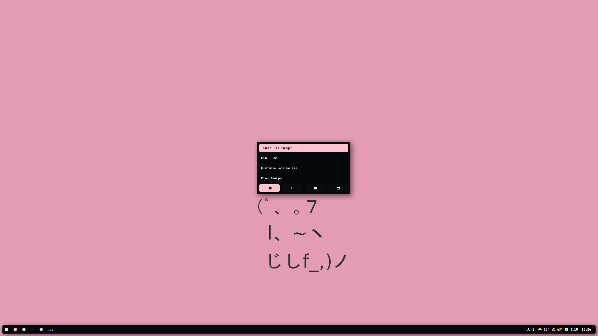
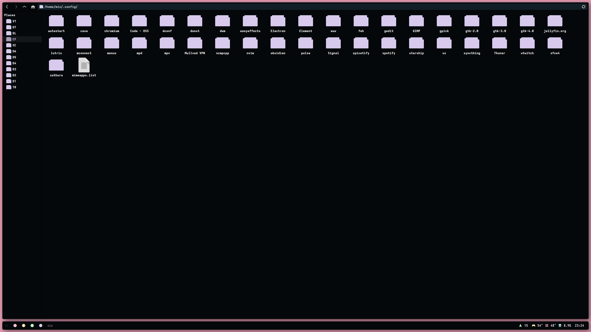
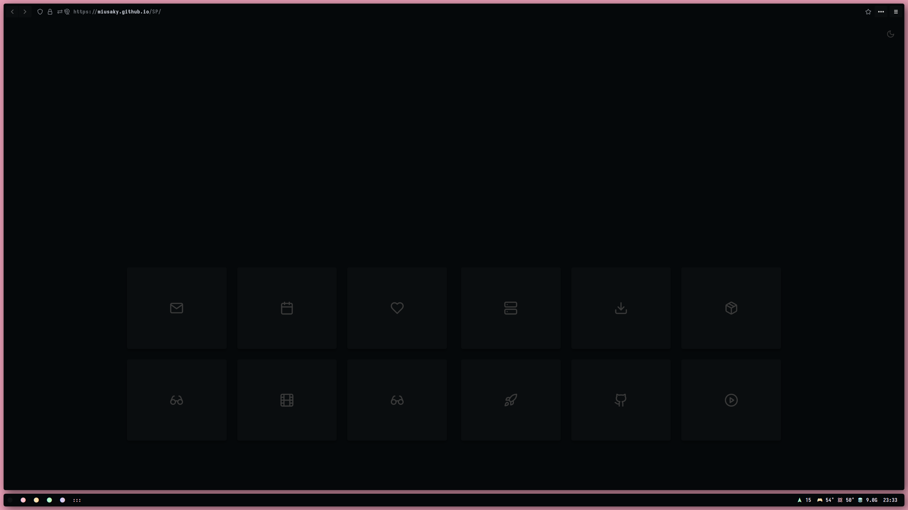
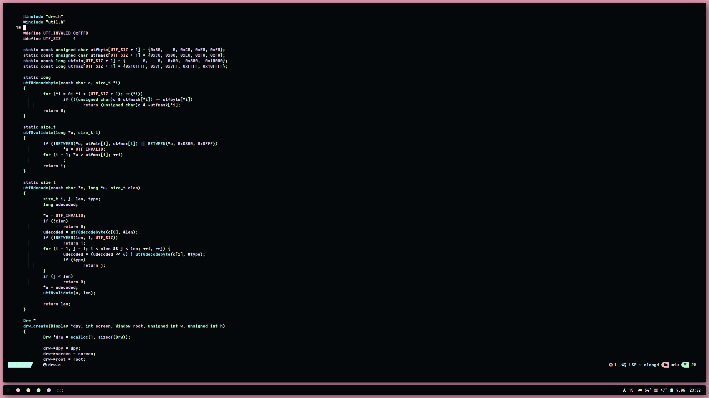
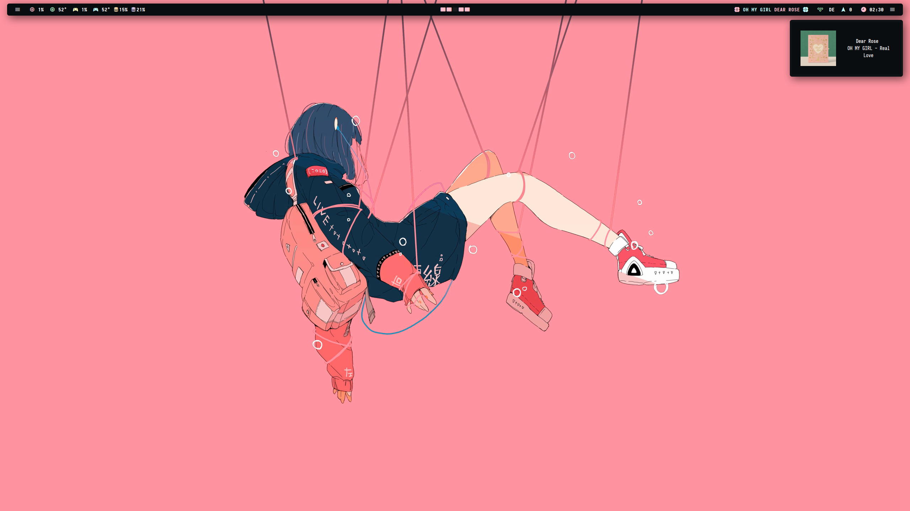
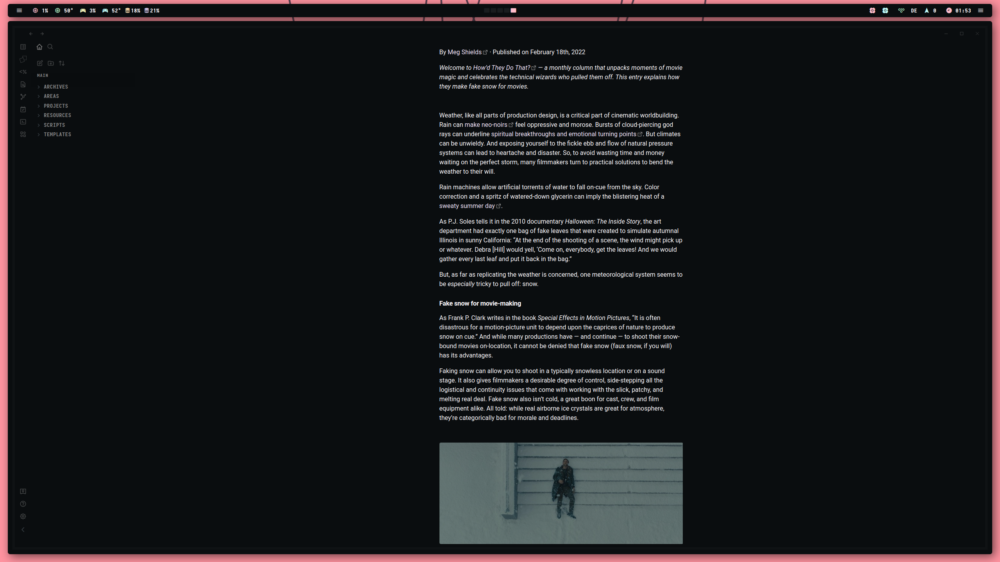

<!-- BADGES -->
   

   
   

  

<H3>Welcome!</H3> 
This repo hosts a collection of dotfiles for various Linux applications. If you like what you see and wish to use them there is a <a href="https://github.com/Miusaky/dotfiles/wiki">wiki</a> to help you replicate each setup. Additional screenshots can be found below.

## GALLERY

### DWM

  
Click to expand.

   
 ##### Dwm
   
 
 ##### Rofi
   
 
 ##### Dunst
   
 
 ##### Thunar
   
 
 ##### Firefox
    
 
 ##### Nvchad
    

### BSPWM

  
Click to expand.

 
 ##### Bspwm
    
  
 ##### Dunst
   

 ##### Rofi 
   
   
 
 ##### GTK
   
 
 ##### Obsidian 
  
 
 ##### Firefox + Zathura + Neovim
    

## TODO
- [ ] Improve nvchad theme.

## ACKNOWLEDGEMENTS
- [Siduck](https://github.com/siduck) for Chadwm and St :heart:
- [Saimoomedits](https://github.com/saimoomedits) for the beautiful ncmpcpp config :heart:
- [Manas140](https://github.com/Manas140) for a few scripts :heart:
- [Elenapan](https://github.com/elenapan) for the rofi-yt and fetch scripts :heart:
