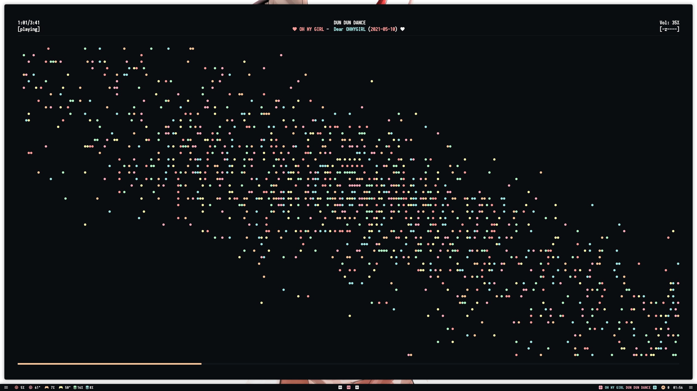
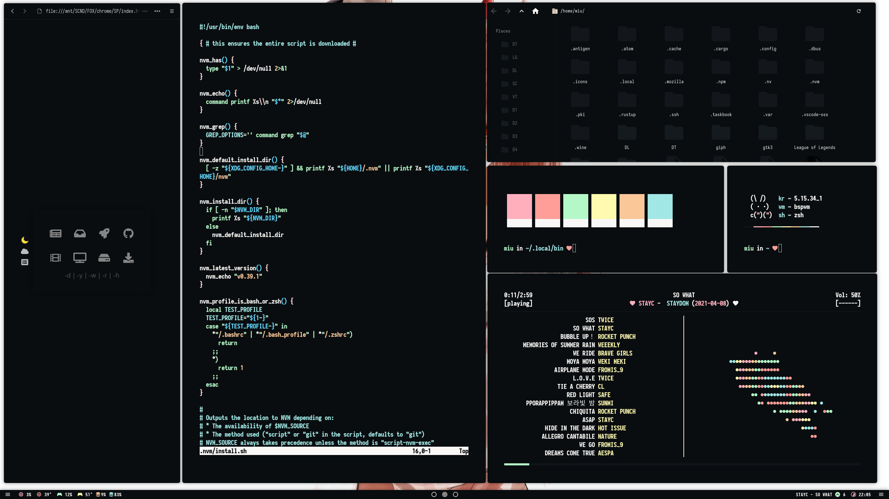
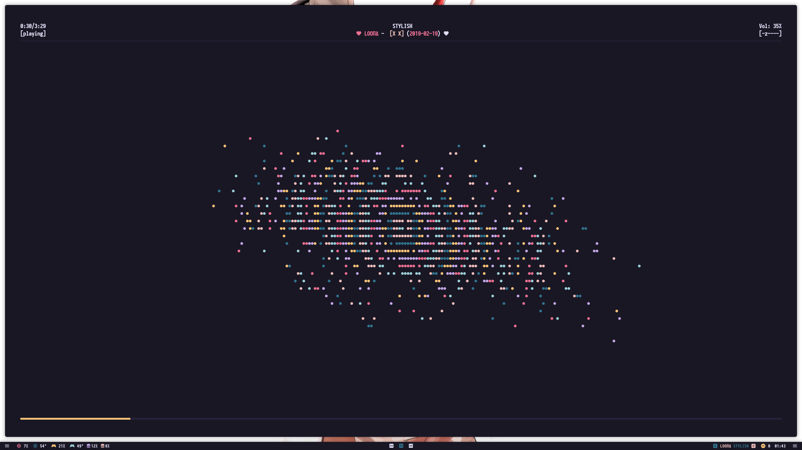
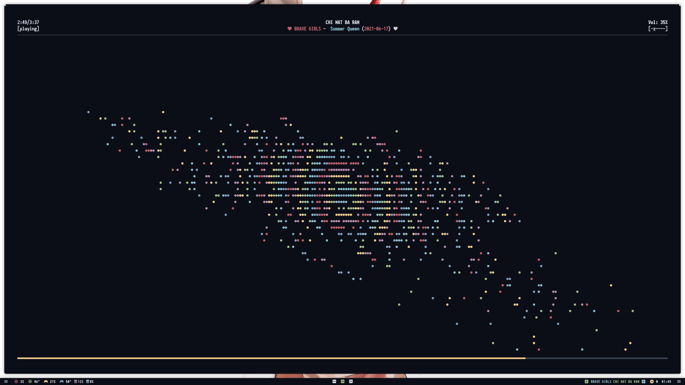
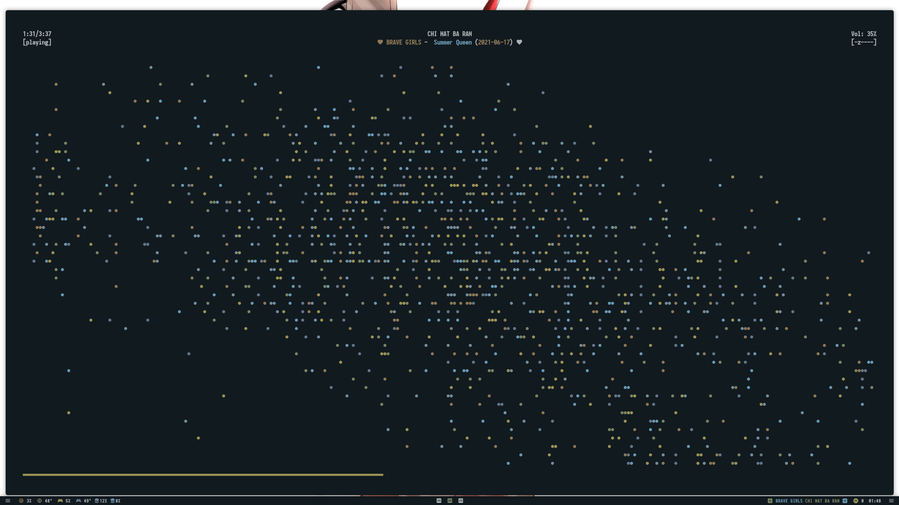
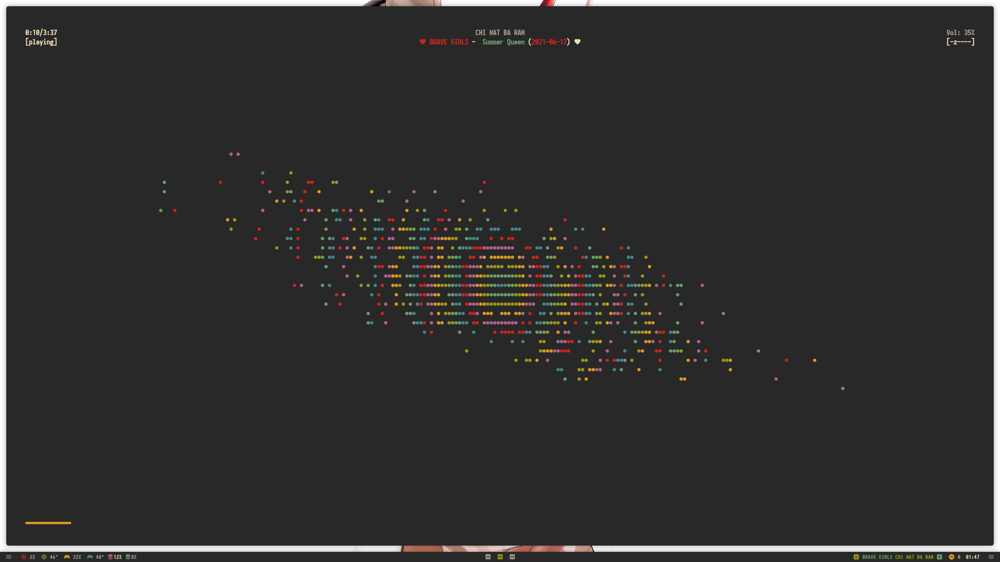
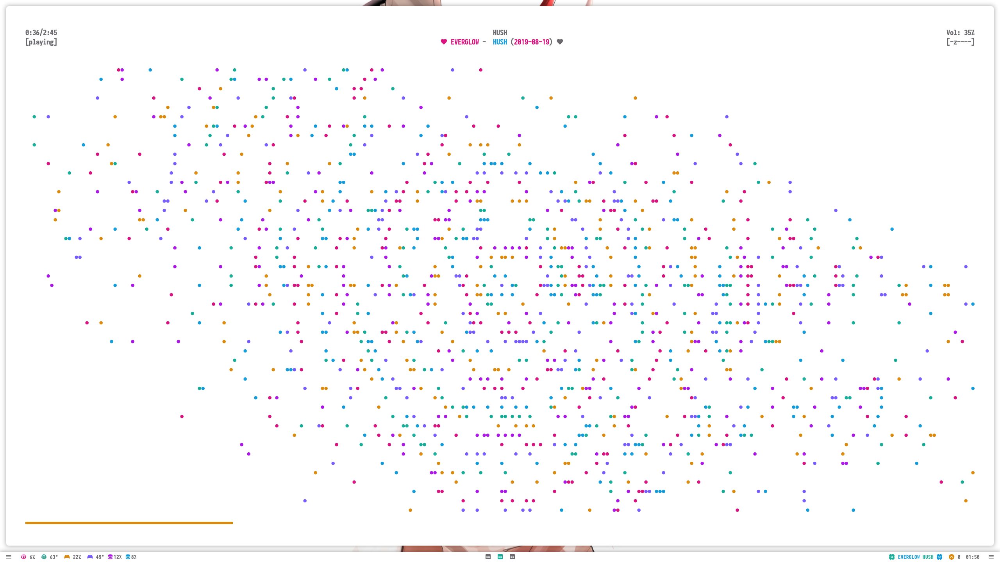

<h2 align="center">:white_flower: :cherry_blossom: :white_flower: :cherry_blossom: :white_flower: :cherry_blossom: :white_flower: :cherry_blossom: :white_flower: Welcome! :white_flower: :cherry_blossom: :white_flower: :cherry_blossom: :white_flower: :cherry_blossom: :white_flower: :cherry_blossom: :white_flower: </h2></br>

 </br>

<h3 align="center"> :white_flower: :cherry_blossom: :white_flower: Scroll down for screenshots :white_flower: :cherry_blossom: :white_flower: </h3> </br> </br>


This is a collection of dotfiles which I use with bspwm. Hope you find something you like! :heart: </br>

Most of these files will work out of the box assuming you have the applications installed (there is a list below). The file structure is a replica of the expected $HOME structure so installing them is as simple as cloning and linking (or moving if you prefer but linking keeps all your configs in one place).

```
git clone https://github.com/Miusaky/bspdots.git $HOME
cp --remove-destination -as $HOME/bspdots/. $HOME/
```

<h3> Dependencies </h3>

| ESSENTIAL  | RECOMMENDED |
|------------|-------------|
| BSPWM      | KITTY       |
| POLYBAR    | HELIX       |
| SXHKD      | ZSH         |
| PICOM      | COLORER     |
| ROFI       | FIREFOX     |
|            | KSUPERKEY   |
|            | MPD         |
|            | NCMPCPP     |

</br>


<h3> Additional notes </h3>


* If you like the colour scheme you can find it [here](https://github.com/SAGAtheme/SAGA) and *some* pre-written themes [here](https://github.com/SAGAtheme/).
* Some bar modules require additional dependencies to work:
    * CPU modules require lm_sensors.
    * Pipewire (available but not enabled out of the box) requires pamixer.
    * Update module requires the xbps package manager (Void Linux). If you're on Arch you can install [this pkg](https://aur.archlinux.org/packages/checkupdates+aur) and replace the command in the config. 
    * VPN module (available not but enabled) requires Mullvad but can be adapted to other providers.
    * Menus and VPN modules make use of rofi to some extent. 
    * GPU modules require an Nvidia card (and the their drivers).
* The rofi powermenu uses loginctl. If it doesn't work for you can replace all occurrences of it in powermenu.sh with systemctl. 
* The included .zshrc depends on the (also included) antigen file to automatically install plugins. Do not use one without the other. 
* If fonts are not rendering make sure you run `fc-cache -v` after linking the files. </br>
* I use [colorer](https://github.com/kiddae/colorer) to switch colour schemes. [SAGA](https://github.com/SAGAtheme/SAGA) is the default palette and if you're satisfied with that you don't need to install colorer as long as you keep its config files ($HOME/.config/colorer). If you do want to test other colours there are quite a few included in $HOME/.config/colorer/flavours. To switch you need to install colorer and run `colorer $HOME/.config/colorer/flavours/schemename`. 
* Fonts, GTK theme and icons are included but you will have to switch to them (either in the gtk file or using something like lxappearance). Iosevka Term Heavy is my primary font. 
* The Firefox theme is not included but can be found [here](https://github.com/SAGAtheme/Firefox).
* Wallpaper is included but can be found [here](https://github.com/Miusaky/bspdots/blob/main/.local/share/wallpapers/wallhaven-28691g.png). 
</br>

## KEYBINDINGS
| MOD | SUPER |
|------------|-------------|
| MOD + RETURN | KITTY |
| MOD + BACKSPACE | FIREFOX |
| MOD + C | KILL CLIENT |
| ALT_L + F1 | ROFI | 

</br>
Look in sxhkdrc for the rest. The above should allow you to adjust the setup to your own preferrences. If you have Ksuperkey installed rofi can be opened with Super alone without disrupting its use as a modifier.


## GALLERY
<details>
  <summary>Click to expand.</summary>
  
 #### SAGA
 </br> 
  
 </br>
 
 </br>
 
 </br>
 
 </br>
 
 #### ROSÉPINE
 </br>

 #### NORD DARK
 </br>
 
 #### ELLY
 </br>
 
 #### GRUVBOX
 </br>
 
 #### DRACULA
 </br>
 
 #### UNIKITTY LIGHT
 </br>
</details>

## TODO

## ACKNOWLEDGEMENTS
- [Kiddae](https://github.com/kiddae) for the lovely tool that is colorer.
- [Siduck](https://github.com/siduck) for his amazing dotfiles which I used for inspiration (and at some point served as templates for mine). 
- [adi1090x](https://github.com/adi1090x) for the beautiful ncmpcpp config.
- [Manas140](https://github.com/Manas140) for a few scripts.
- [/r/unixporn](https://teddit.net/r/unixporn) for inspiration over the years.


## MISCELLANEOUS
- If you don't like bspwm you should check out [Hypr](https://github.com/vaxerski/Hypr). It is an amazing WM with sleek animations and an active dev who listens to feedback.

