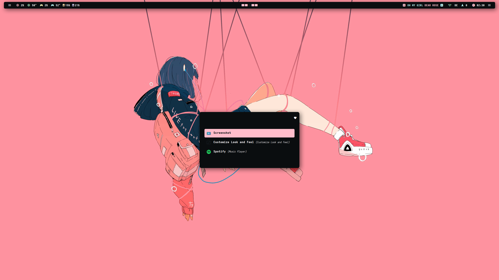

<div align="center">


<!-- BADGES -->
   <p></p>
   <a href="">
      
   </a>
   <a href="https://github.com/miusaky/bspdots/stargazers">
      
   </a>
   <a href="https://github.com/miusaky/bspdots/">
      
   </a>
   <a href="https://github.com/miusaky/bspdots/">
      
  </a>
  <H3>  ━━━━━━━━━━━━━━━━━━━━━━━━━━━━━━━  ❖  ━━━━━━━━━━━━━━━━━━━━━━━━━━━━━━━ </H3>
</div>
<p/>


</br> 

<div align="center">  <H3>  ━━━━━━━━━━━━━━━━━━━━━━━━━━━━━━━  ❖  ━━━━━━━━━━━━━━━━━━━━━━━━━━━━━━━ </H3> </br> <H3>Welcome!</H3> <H4>This repo hosts a collection of dotfiles for bspwm and various applications I use with it.</H4> </div>

Most of these files will work out of the box assuming you have the applications installed (there is a list below). The file structure is a replica of the expected $HOME structure so installing them is as simple as cloning and linking (or moving if you prefer but linking keeps all your configs in one place). </br>

```
git clone https://github.com/Miusaky/bspdots.git $HOME/
cp --remove-destination -as $HOME/bspdots/. $HOME/
```

<h3> Dependencies </h3>

| FUNCTION  | NAME | 
| :----------: |:----------: |
| **WM** | **BSPWM** |
| **TERM** | **ALACRITTY** |
| **BAR** | **POLYBAR** |
| **COMPOSITOR** | **PICOM** |
| **LAUNCHER** | **ROFI** |
| **BROWSER** | **LIBREWOLF** |
</br>

In addition there are a number of utilities I use which make life easier such as fzf and redshift. You can pick and choose the ones you want but please see the additional notes section below for hard dependencies. 

<h3> Additional notes </h3>


* If you like the colour scheme you can find it [here](https://github.com/SAGAtheme/SAGA) and *some* pre-written themes [here](https://github.com/SAGAtheme/).
* Some bar modules require additional dependencies to work:
    * CPU modules require lm_sensors.
    * Pipewire (available but not enabled out of the box) requires pamixer.
    * Update module is configured for Arch. There is a line included for Void Linux but you'll need to uncomment it and replace the Arch script with it in modules.ini. If you're on a different distribution you'll need to adapt it yourself. 
    * VPN module requires [Mullvad](https://mullvad.net) but can be adapted to other providers. See the vpn script included and adapt it to your needs. 
    * Menus and VPN modules make use of rofi to some extent. VPN module will still show location in the bar but won't support interactive actions without rofi. 
    * GPU modules require an Nvidia card (and the their drivers).
* The rofi powermenu uses systemctl. Switch entries to loginctl if you're on a non-systemd-distribution.
* The included .zshrc depends on the (also included) antigen file to automatically install plugins. Do not use one without the other. 
* If fonts are not rendering make sure you run `fc-cache -v` after linking the files. </br>
* Fonts, GTK theme and icons are included but you will have to switch to them (either via the config file or something like lxappearance). The font I use is a mix of SAGA Heavy and Sarasa Mono.
* I use [nvchad](https://github.com/nvchad/nvchad) for nvim. If you want the SAGA theme install nvchad and rename the nvchad folder in this repo to 'custom' and move it to $HOME/.config/nvim/lua/.  
* The Firefox theme is not included but can be found [here](https://github.com/SAGAtheme/Firefox).
</br>

## BASIC KEY BINDINGS
| KEY  | FUNCTION | 
| :----------: |:----------: |
| **MOD + RETURN** | **TERM** |
| **MOD + BACKSPACE** | **FIREFOX** |
| **MOD + C** | **CLOSE FOCUSED CLIENT** |
| **ALT_L + F1** | **ROFI** |
| **MOD + M** | **NCMPCPP** |
| **MOD + R** | **ENABLE REDSHIFT** |
| **MOD + SHIFT + R** | **DISABLE REDSHIFT** |

Look in sxhkdrc for the rest. The above should allow you to adjust the setup to your own preferrences. MOD is Mod4 or what is commonly referred to as the Windows key. If you have [ksuperkey](https://github.com/hanschen/ksuperkey) installed pressing mod4 once will open rofi whilst still functioning as the main modifier. Highly recommend it. 

## GALLERY
<details>
  <summary>Click to expand.</summary>
 ##### WALL
 </br> 
 ##### DUNST
 </br> 
 ##### ROFI
 </br> 
 </br> 
 ##### OBSIDIAN
 </br>
 ##### FIREFOX
 </br>  
 ##### GTK
 </br> 
</details>

## TODO

## ACKNOWLEDGEMENTS
- [Siduck](https://github.com/siduck) whose dotfiles I've used for inspiration on several occasions :heart:
- [saimoomedits](https://github.com/saimoomedits) for the beautiful ncmpcpp config :heart:
- [Manas140](https://github.com/Manas140) for a few scripts :heart:
- [Elenapan](https://github.com/elenapan) for the rofi-yt script :heart:

<p align="center"></p>
